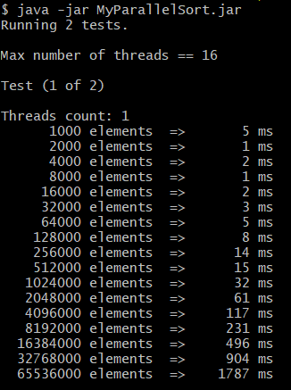
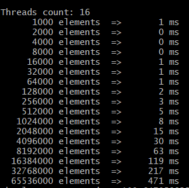
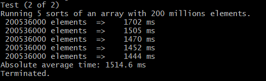

# MyParallelSort
This project is my own attempt to implement parallel sort. 
I combined standard Array.sort with parallel merge.
The program runs 2 tests to see the performance of my hybrid parallel sort.

